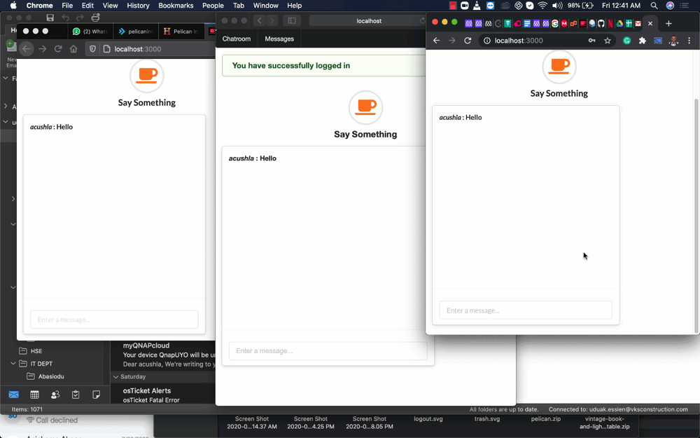

# Message Me APP

In this project I developed a simple chat app using Rails ActionCable feature with Redis Server



## Built With

- Ruby on Rails
- Ruby

# Getting Started

To get a local copy of the repository please run the following commands on your terminal:

```
$ cd <folder>
```

~~~bash
$ git clone https://github.com/acushlakoncept/message-me.git
$ cd message-me
$ bundle install 
$ rails db:migrate
~~~

# Authors

👤 **Uduak Essien**

- Github: [@acushlakoncept](https://github.com/acushlakoncept/)
- Twitter: [@acushlakoncept](https://twitter.com/acushlakoncept)
- Linkedin: [acushlakoncept](https://www.linkedin.com/in/acushlakoncept/)


## 🤝 Contributing

Contributions, issues and feature requests are welcome!

## Show your support

Give a ⭐️ if you like this project!
